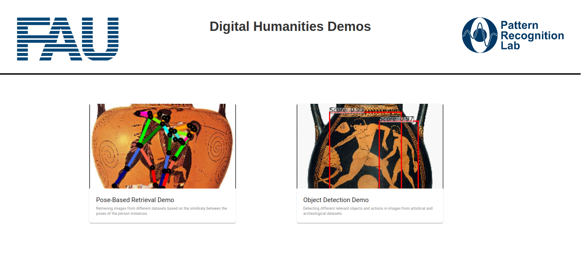
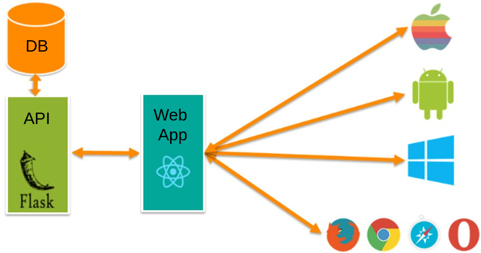

# Pose Based Image Retrieval

This repository contains the source code for the  **Pose-Based Retrueval Demo** developed at the [Computer Vision Group](https://lme.tf.fau.de/research/research-groups/computer-vision/) from the University of Erlangen-Nuremberg.



## Contents

 * [1. Description](#description)
 * [2. Structure](#directory-structure)
 * [3. Quick Guide](#quick-guide)
 * [4. Change Log](#change-log)
 * [5. Contact](#contact)


## Description

Large digital art libraries are rapidly growing due to the ongoing efforts in digitization of art collections. Nevertheless, due to content complexity and large size, navigation within such collections often becomes a difficult and time-consuming task.

This repository contains the source code for out **Digital Humanities Demos**.
This web-app contains several *demos*, in which we demonstrate of research and algorithms on how to apply computer vision tasks to archeological or artistic data.

To get the code, fork the repository or clone it using the following command:

```
  git clone https://github.com/angelvillar96/PoseBasedRetrievalDemo.git
```

## Structure

The architecture of the web-app ecosystem is depicted in the following figure:



The demos are implemeted as a web-app using the [ReactJS](https://reactjs.org/) framework. This allows users to easily access the different demos from the web-browser.

The web-apps communicate via HTTP with our backend-infrastructure through a REST-API implemented with Python and [Flask](https://flask.palletsprojects.com/en/1.1.x/deploying/). This allows all computation to take place in our servers.

The different databases and deep learning models are stored in one of our servers, thus minimizing the computation load that takes place in the client-side.

For further implementation details, please check the specific documentation:

Tool | Documentation | Root Directory
------------ | ------------- | -------------
Web-APP | [Readme](https://github.com/angelvillar96/PoseBasedRetrievalDemo/blob/master/src/pose-based-retrieval-demo/README.md) | [Web-APP Directory](https://github.com/angelvillar96/PoseBasedRetrievalDemo/tree/master/src/pose-based-retrieval-demo)
API | [Readme](https://github.com/angelvillar96/PoseBasedRetrievalDemo/blob/master/src/API/README.md) | [API Directory](https://github.com/angelvillar96/PoseBasedRetrievalDemo/tree/master/src/API)

## Quick Guide

Coming Soon


## Change Log

 - (23.10.2020) First running version of the ecosystem. *Pose-based retrieval* demo deployed.


## Contact

This project was developed by [Angel Villar-Corrales](http://angelvillarcorrales.com/templates/home.php)

In case of any questions or problems regarding the project or repository, do not hesitate to contact me at angelvillarcorrales@gmail.com.
